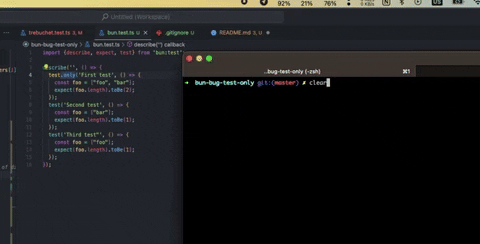

# bun-bug-test-only

## Showcase of current bug in Bun test runner methods

Current finding shows that, running `bun test` without the `-only` flag, does run tests until it finds the .only on one test.



In order to reproduce the bug please run:

```bash
bun install
```

Place a `.only` either on the "Second", or "Third" test.

To run the test suite:

```bash
bun test
```

check that console output reflects that tests above it are also run


This project was created using `bun init` in bun v1.0.15. [Bun](https://bun.sh) is a fast all-in-one JavaScript runtime.
